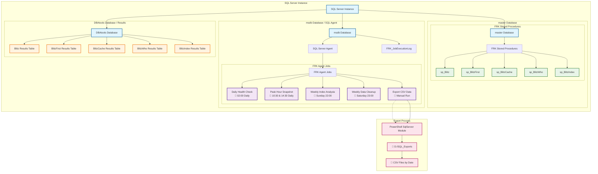

# First Responder Kit (FRK) Full Automation Script

## Overview

This repository provides a complete automation framework for deploying and managing Brent Ozar's First Responder Kit (FRK) tools in SQL Server environments. The solution transforms manual health checks into a fully automated, continuously scheduled monitoring system that requires zero ongoing maintenance.

## Key Features

- **One-Click Deployment**: Single script installs 5 SQL Agent jobs with production-ready schedules
- **Comprehensive Health Monitoring**: Automated execution of sp_Blitz, sp_BlitzFirst, sp_BlitzCache, sp_BlitzWho, and sp_BlitzIndex
- **Robust Error Handling**: Transaction-safe deployment with complete rollback on failure
- **Audit Trail**: Complete logging of all job executions with start/end times and error details
- **Data Export**: PowerShell-based CSV export functionality for external analysis
- **Configurable Retention**: Automated cleanup with configurable data retention policies

## At a Glance

| Component | Purpose |
|-----------|---------|
| **Daily Health Check** | Comprehensive server health assessment (02:00 AM) |
| **Peak Hour Monitoring** | Performance snapshots during business hours (10:30 AM & 2:30 PM) |
| **Weekly Index Analysis** | Deep-dive index optimization recommendations (Sunday 10:00 PM) |
| **Data Cleanup** | Automated retention management (Saturday 11:00 PM) |
| **CSV Export** | On-demand data extraction to local files (Manual) |

## Quick Start

1. **Prerequisites**
   - SQL Server 2016+ with SQL Agent enabled
   - [First Responder Kit](https://github.com/BrentOzarULTD/SQL-Server-First-Aid-Kit) installed in `master` database
   - Service account with appropriate permissions

2. **Installation**
   ```sql
   -- Edit configuration parameters as needed
   USE [msdb];
   -- Run the FRK_Automation.sql script
   ```

3. **Verification**
   ```sql
   -- Check deployed jobs
   SELECT name, enabled FROM msdb.dbo.sysjobs 
   WHERE name LIKE 'FRK - %';
   
   -- View execution logs
   SELECT TOP 10 * FROM msdb.dbo.FRK_JobExecutionLog 
   ORDER BY StartTime DESC;
   ```

## Architecture



## Configuration

The system is fully configurable through a simple parameter table:

```sql
INSERT INTO #FRK_Config VALUES
(
    N'DBAtools',                        -- Target database name
    30,                                 -- Data retention days
    N'YourServiceAccount',              -- Job owner (avoid 'sa')
    N'Database Maintenance (FRK)',      -- Job category
    N'D:\SQL_Exports'                   -- Export directory
);
```

## Default Schedules

| Job Name | Schedule | Purpose |
|----------|----------|---------|
| FRK - Daily Health Check | Daily at 02:00 AM | Complete health assessment |
| FRK - Peak Hour Performance Snapshot | Daily at 10:30 AM & 2:30 PM | Business hours monitoring |
| FRK - Weekly Index Analysis | Sunday at 10:00 PM | Index optimization analysis |
| FRK - Weekly Data Cleanup | Saturday at 11:00 PM | Automated data retention |
| FRK - Export Raw Data Locally | Manual execution | CSV data export |

## Security Considerations

- **Service Account**: Use dedicated service account with minimal required permissions
- **File Permissions**: Ensure SQL Agent service account has write access to export directory
- **PowerShell Execution**: Uses modern SqlServer module with secure execution policies
- **Database Permissions**: Requires VIEW SERVER STATE, ALTER TRACE permissions

## Monitoring and Troubleshooting

### View Recent Job Activity
```sql
SELECT 
    JobName,
    StepName,
    StartTime,
    EndTime,
    Success,
    ErrorMessage
FROM msdb.dbo.FRK_JobExecutionLog
WHERE StartTime >= DATEADD(DAY, -7, GETDATE())
ORDER BY StartTime DESC;
```

### Common Issues

| Issue | Cause | Resolution |
|-------|-------|------------|
| "Service account does not exist" | Invalid `@JobOwner` | Create service account or update configuration |
| PowerShell execution fails | Missing SqlServer module | `Install-Module SqlServer -Force` |
| Export path access denied | Insufficient permissions | Grant write access to SQL Agent service account |
| Cleanup fails with retention error | `@RetentionDays` < 7 | Increase retention period to 7+ days |

## Documentation

- **[QuickStart Guide](docs/QuickStart.md)** - 5-minute installation walkthrough
- **[Configuration Reference](docs/ConfigurationReference.md)** - Detailed parameter documentation
- **[Job Reference](docs/JobReference.md)** - Complete job specifications and tuning guide


## Contributing

1. Fork the repository
2. Create a feature branch (`git checkout -b feature/enhancement`)
3. Test your changes against SQL Server 2016+ environments
4. Submit a pull request with detailed description


## Acknowledgments

- [Brent Ozar Unlimited](https://www.brentozar.com/) for the First Responder Kit
- SQL Server community for best practices and feedback
- Contributors who have helped improve this automation framework

## Support

- **Issues**: Report bugs and feature requests via GitHub Issues
- **Documentation**: Comprehensive guides available in the `docs/` directory
- **Community**: Join discussions in the repository's Discussions tab

---

**Note**: This tool is designed for production use but should be tested in development environments first. Always review and understand the scripts before deploying to critical systems.
